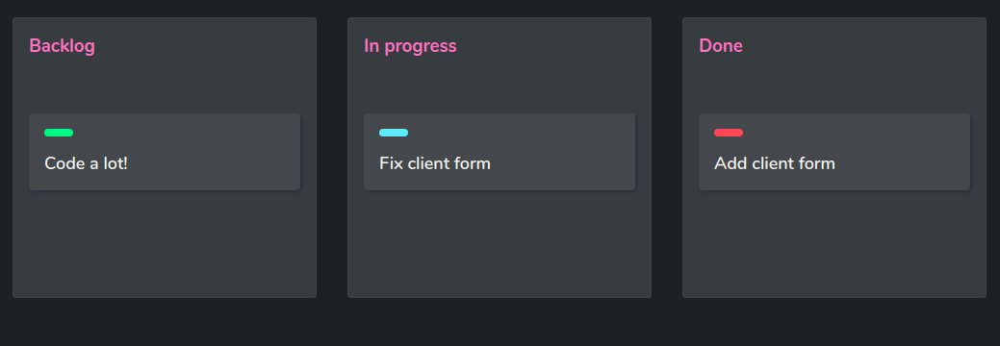

<h1 align="center">
   
  Drag and Drop
</h1>

  A kanban sample - as simple as possible. You may know similar task managers
   
  like Trello, Jira, Breeze and dozen of others based on cards sinalization.
    
  Made under 
  <a href="https://github.com/Rocketseat">@Rocketseat</a> 
  <a href="https://github.com/maykbrito">@maykbrito</a> 's instructions over
  <a href="https://youtu.be/6wn8hpUcEcM">here</a>.

  

  

## Features

No external libs or webframeworks! Drag and Drop was made for easy implementation in any project.

## Getting started

1. Clone this repo using `git clone git@github.com:SamuelPietra/Drag-N-Drop.git`
2. Move yourself to the appropriate directory: `cd drag-n-drop` 
3. Run `index.html` in any local server 
4. I recommend using `Live Server` vscode extension

## Simple as that

You're ready to go! Use darkmode with no moderation ;-)

## License

This project is licensed under the MIT License - see the [LICENSE](https://opensource.org/licenses/MIT) page for details.
